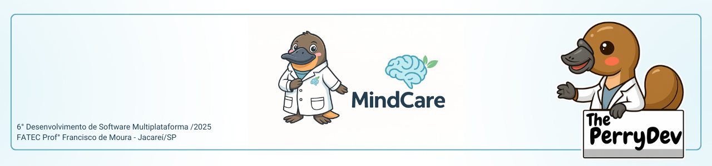
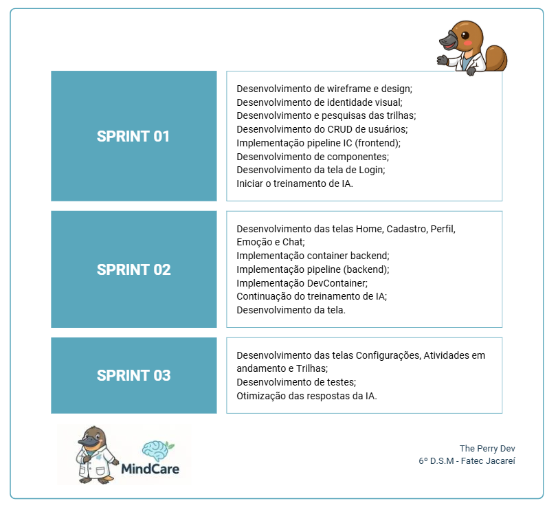
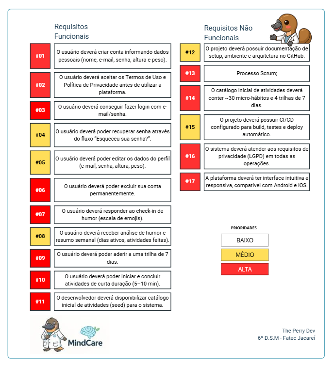
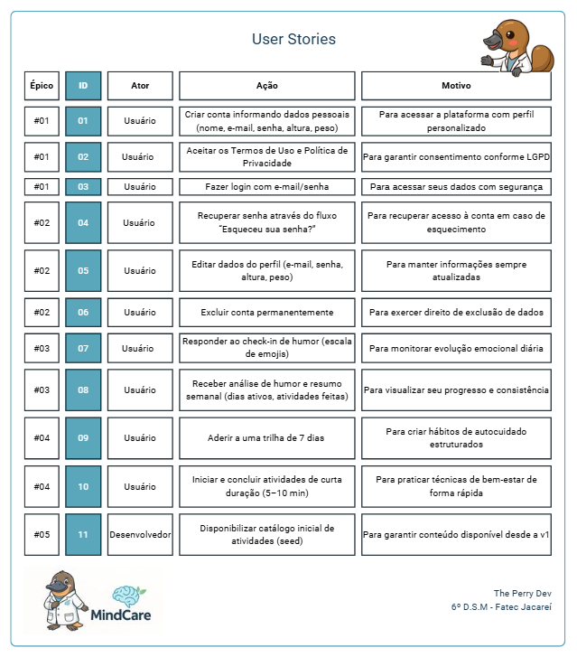

 

 

    <a href="#sobre">Sobre</a>  |  
    <a href="#backlogs">Backlog</a>  |  
    <a href="#user-stories">User Stories</a>  |    
    <a href="#tecnologias">Tecnologias</a>  |  
    <a href="#equipe">Equipe</a>

## :bookmark_tabs: Sobre o projeto

A partir do desafio proposto pela FATEC, a equipe The PerryDev apresentou como solução o desenvolvimento de um aplicativo móvel que possibilita ao usuário monitorar seu humor e, ao mesmo tempo, receber sugestões de hábitos voltados à melhoria do bem-estar.

Projeto conduzido a partir da metodologia ágil, aplicando o framework Scrum, para incentivar a proatividade, autonomia, colaboração e a entrega de valor de todos os envolvidos.

:pushpin: Status do Projeto: [**Finalizado**]

### Entregas de Sprints

Cada entrega do projeto será identificada por meio da criação de uma tag no repositório [MindCare](https://github.com/ThePerryDev/MindCare). Além disso, serão criadas branches específicas para cada atividade (task) realizada, seguindo o seguinte padrão: sp0-000/nome/nomeDaTask, permitindo um controle mais detalhado das etapas de desenvolvimento e facilitando o acompanhamento da evolução do projeto. Observe a relação a seguir:

| Sprint | Previsão | Status | Histórico/Releases | Link da Apresentação | Gráfico Burndown |
| :----: | :------------------------: | :-------------- | :----------------------------------: | :-----------------------------------------------------------------------: | :-----------------------------------------------------------------------: |
| 01 | De 16/09/25 a 02/10/25 | 🟢 Finalizado | [Ver relatório](https://github.com/ThePerryDev/MindCare/releases/tag/sprint_1) | [Apresentação SPRINT 01](https://youtu.be/lf4rOiNSk8A) |  |
| 02 | De 13/10/25 a 31/10/25 | 🟢 Finalizado | [Ver relatório](https://github.com/ThePerryDev/MindCare/releases/tag/sprint_2) | [Apresentação SPRINT 02](https://www.youtube.com/watch?v=OspOHwWwxlQ) |  |
| 03 | De 06/11/25 a 18/11/25 | 🟢 Finalizado | [Ver relatório](https://github.com/ThePerryDev/MindCare/releases/tag/sprint_3) | [Apresentação SPRINT 03](https://youtu.be/goeCbbWa77U) |  |

## :dart: Backlog

 

 

→ [Voltar ao topo](#topo)

## :mag: User Stories

 

→ [Voltar ao topo](#topo)

## :pager: Tecnologias

Para o desenvolvimento deste projeto, foram empregadas diversas linguagens, ferramentas, tecnologias e bibliotecas, selecionadas de forma criteriosa para assegurar uma implementação eficiente e em conformidade com os requisitos estabelecidos. A seguir, apresentamos os principais recursos utilizados.

<!-- VS Code -->

<!-- Figma -->

<!-- Canva -->

<!-- Python -->

<!-- Docker -->

<!-- TypeScript -->

<!-- React Native -->

<!-- Expo -->

<!-- Node.js -->

<!-- MongoDB -->

<!-- Pinterest -->

## :busts_in_silhouette: Equipe

|    Função     | Nome                                  |                                                                                                                                                      LinkedIn & GitHub                                                                                                                                                      |
| :-----------: | :------------------------------------ | :-------------------------------------------------------------------------------------------------------------------------------------------------------------------------------------------------------------------------------------------------------------------------------------------------------------------------: |
|   Scrum Master    | Luis Eduardo                     |            |
|   Product Owner    | Franciele Chesere               |   |
|   Dev Team    | Bianca Lucas                |       |
|   Dev Team    | Claudia Nunes                |       |
|   Dev Team    | Daniel Dornelas          |                     |
|   Dev Team    | Heclair Sousa               |   |
|   Dev Team   | Willian Garcia         |                 |

→ [Voltar ao topo](#topo)
