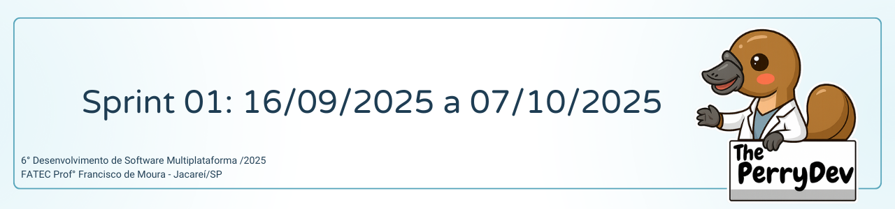

 

 

    <a href="#sobre">Sobre</a>  |  
    <a href="#backlogs">Backlog</a>  |  
    <a href="#user-stories">User Stories</a>  |    
    <a href="#tecnologias">Tecnologias</a>  |  
    <a href="#equipe">Equipe</a>  | 
    <a href="#comorodar">Como Rodar</a>

## :bookmark_tabs: Sobre o projeto

A partir do desafio proposto pela FATEC, a equipe The Perry Dev apresentou como solução o desenvolvimento de um aplicativo móvel que possibilita ao usuário monitorar seu humor e, ao mesmo tempo, receber sugestões de hábitos voltados à melhoria do bem-estar.

Projeto conduzido a partir da metodologia ágil, aplicando o framework Scrum, para incentivar a proatividade, autonomia, colaboração e a entrega de valor de todos os envolvidos.

:pushpin: Status do Projeto: [**Em andamento**] <!--(https://github.com/ThePerryDev/NutriPerry/tree/sp1/develop) -->

### Entregas de Sprints

Cada entrega do projeto será identificada por meio da criação de uma tag no repositório [MindCare](https://github.com/ThePerryDev/MindCare). Além disso, serão criadas branches específicas para cada atividade (task) realizada, seguindo o seguinte padrão: sp0-000/nome/nomeDaTask, permitindo um controle mais detalhado das etapas de desenvolvimento e facilitando o acompanhamento da evolução do projeto. Observe a relação a seguir:

| Sprint | Previsão | Status | Histórico | Link da Apresentação
|:------:|:----------:|:-------------|:-------------------------------------------------:|:-------------------------------------------------:|
| 01 | De 16/09/2025 a 07/10/2025 | 🟡 Em andamento | <a href="#sprint1">Ver relatório</a> | <!--[SPRINT 01](https://drive.google.com/file/d/1X_RZB2BagwwqgAaqVM5RqBzSTGLluFpU/view?usp=drive_link)-->|
| 02 | De 18/09/24 a 08/10/24 | 🔴 Finalizado | <a href="#sprint2">Ver relatório</a> | <!--[SPRINT 02](https://youtu.be/mZhYl-Wf9Bk)-->|
| 03 | De 09/10/24 a 08/11/24 | 🔴 Finalizado |  <a href="#sprint3">Ver relatório</a> |  <!--[SPRINT 03](https://youtu.be/mZhYl-Wf9Bk)--> |

<!--🟢-->

## :dart: Backlog 

 

 

→ [Voltar ao topo](#topo)

## :mag: User Stories

 

→ [Voltar ao topo](#topo)

## :pager: Tecnologias

 

| **NOME**   | **16/09/2025** | **18/09/2025** | **22/09/2025** | **24/09/2025** | **26/09/2025** | **30/09/2025** | **02/10/2025** |
|-----------|---------------|---------------|---------------|---------------|---------------|---------------|---------------|
| **Eduardo**   | PLN-001 | XX-008 | XX-015 | XX-022 | XX-029 | XX-036 | XX-043 |
| **Franciele**    | PLN-002 | XX-009 | XX-016 | XX-023 | XX-030 | XX-037 | XX-044 |
| **Claudia**    | PLN-003 | XX-010 | XX-017 | XX-024 | XX-031 | XX-038 | XX-045 |
| **Willian** | PLN-004 | XX-011 | XX-018 | XX-025 | XX-032 | XX-039 | XX-046 |
| **Bianca**   | PLN-005 | XX-012 | XX-019 | XX-026 | XX-033 | XX-040 | XX-047 |
| **Daniel**   | PLN-006 | XX-013 | XX-020 | XX-027 | XX-034 | XX-041 | XX-048 |
| **Heclair**   | PLN-007 | XX-014 | XX-021 | XX-028 | XX-035 | XX-042 | XX-049 |

