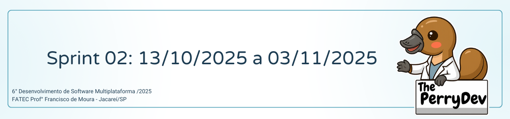

 

 

    <a href="#sobre">Sobre</a>  |  
    <a href="#backlogs">Backlog</a>  |  
    <a href="#user-stories">User Stories</a>  |    
    <a href="#tecnologias">Tecnologias</a>  |  
    <a href="#equipe">Equipe</a>  | 
    <a href="#comorodar">Como Rodar</a>

## :bookmark_tabs: Sobre o projeto

A partir do desafio proposto pela FATEC, a equipe The Perry Dev apresentou como solução o desenvolvimento de um aplicativo móvel que possibilita ao usuário monitorar seu humor e, ao mesmo tempo, receber sugestões de hábitos voltados à melhoria do bem-estar.

Projeto conduzido a partir da metodologia ágil, aplicando o framework Scrum, para incentivar a proatividade, autonomia, colaboração e a entrega de valor de todos os envolvidos.

:pushpin: Status do Projeto: [**Em andamento**] <!--(https://github.com/ThePerryDev/NutriPerry/tree/sp1/develop) -->

### Entregas de Sprints

Cada entrega do projeto será identificada por meio da criação de uma tag no repositório [MindCare](https://github.com/ThePerryDev/MindCare). Além disso, serão criadas branches específicas para cada atividade (task) realizada, seguindo o seguinte padrão: sp0-000/nome/nomeDaTask, permitindo um controle mais detalhado das etapas de desenvolvimento e facilitando o acompanhamento da evolução do projeto. Observe a relação a seguir:

| Sprint |          Previsão          | Status          |              Histórico               |                                           Link da Apresentação                                            |
| :----: | :------------------------: | :-------------- | :----------------------------------: | :-------------------------------------------------------------------------------------------------------: |
|   01   | De 16/09/25 a 07/10/25 | 🟡 Em andamento | <a href="#sprint1">Ver relatório</a> | <!--[SPRINT 01](https://drive.google.com/file/d/1X_RZB2BagwwqgAaqVM5RqBzSTGLluFpU/view?usp=drive_link)--> |
|   02   |   De 18/09/25 a 08/10/25   | 🔴 Finalizado   | <a href="#sprint2">Ver relatório</a> |                             <!--[SPRINT 02](https://youtu.be/mZhYl-Wf9Bk)-->                              |
|   03   |   De 09/10/25 a 08/11/25   | 🔴 Finalizado   | <a href="#sprint3">Ver relatório</a> |                             <!--[SPRINT 03](https://youtu.be/mZhYl-Wf9Bk)-->                              |

<!--🟢-->

## :dart: Backlog

 

 

→ [Voltar ao topo](#topo)

## :mag: User Stories

 

→ [Voltar ao topo](#topo)

## :pager: Tecnologias

Para o desenvolvimento deste projeto, foram empregadas diversas linguagens, ferramentas, tecnologias e bibliotecas, selecionadas de forma criteriosa para assegurar uma implementação eficiente e em conformidade com os requisitos estabelecidos. A seguir, apresentamos os principais recursos utilizados.

<!-- Figma -->

<!-- Canva -->

<!-- Python -->

<!-- Docker -->

<!-- TypeScript -->

## :busts_in_silhouette: Equipe

|    Função     | Nome                                  |                                                                                                                                                      LinkedIn & GitHub                                                                                                                                                      |
| :-----------: | :------------------------------------ | :-------------------------------------------------------------------------------------------------------------------------------------------------------------------------------------------------------------------------------------------------------------------------------------------------------------------------: |
|   Scrum Master    | Luis Eduardo                     |            |
|   Product Owner    | Franciele Chesere               |   |
|   Dev Team    | Bianca Lucas                |       |
|   Dev Team    | Claudia Nunes                |       |
|   Dev Team    | Daniel Dornelas          |                     |
|   Dev Team    | Heclair Sousa               |   |
|   Dev Team   | Willian Garcia         |                 |

→ [Voltar ao topo](#topo)

| **NOME**      | **16/09/2025** | **18/09/2025** | **22/09/2025** | **24/09/2025** | **26/09/2025** | **30/09/2025** | **02/10/2025** |
| ------------- | -------------- | -------------- | -------------- | -------------- | -------------- | -------------- | -------------- |
| **Eduardo**   | PLN-001        | XX-008         | XX-015         | XX-022         | XX-029         | XX-036         | XX-043         |
| **Franciele** | PLN-002        | XX-009         | XX-016         | XX-023         | XX-030         | XX-037         | XX-044         |
| **Claudia**   | PLN-003        | XX-010         | XX-017         | XX-024         | XX-031         | XX-038         | XX-045         |
| **Willian**   | PLN-004        | XX-011         | XX-018         | XX-025         | XX-032         | XX-039         | XX-046         |
| **Bianca**    | PLN-005        | XX-012         | XX-019         | XX-026         | XX-033         | XX-040         | XX-047         |
| **Daniel**    | PLN-006        | XX-013         | XX-020         | XX-027         | XX-034         | XX-041         | XX-048         |
| **Heclair**   | PLN-007        | XX-014         | XX-021         | XX-028         | XX-035         | XX-042         | XX-049         |

→ [Voltar ao topo](#topo)

→ [Voltar ao topo](#topo)

→ [Voltar ao topo](#topo)